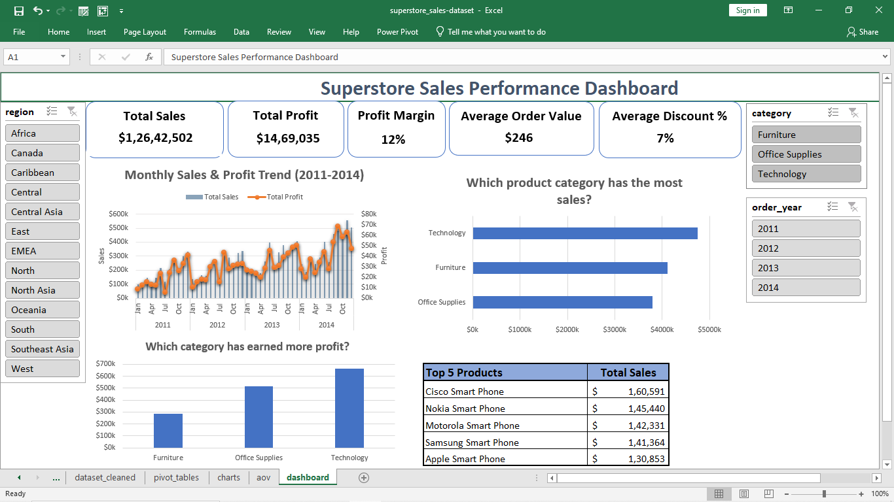
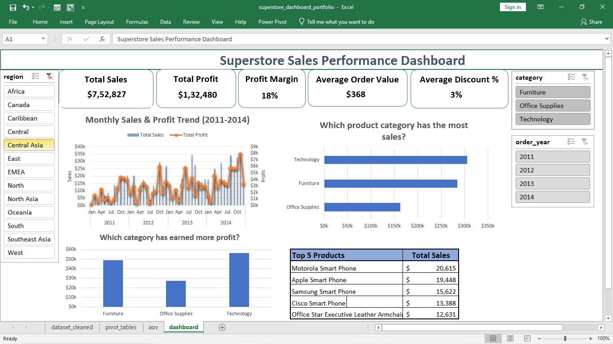

# Excel Dashboard Project

## 📊 Project Overview
This Excel dashboard project was created as part of my **Data Analytics learning journey**.
The goal of this project is to analyze Superstore sales data and present key business insights through an interactive dashboard.

## 🛠 Tools & Skills Used
- Microsoft Excel
- Data Cleaning
- Pivot Tables
- Charts & Data Visualization
- Slicers & Interactivity
- Dashboard Design

## 📈 Key Insights
- Achieved **$12.6M in total sales** with a **12% profit margin**.
- **Technology** is the leading category in both sales and profit.
- **Smartphones** lead top sales, reflecting strong demand in the Technology segment.
- Average **7% discount** supports growth without hurting profitability.
- An **average order value of $246** reflects relatively high-value customer purchases.
- Sales and profit trends show **steady growth with seasonal peaks**.

## 🖼 Dashboard Preview

## 📂 Files in This Repository
- `superstore_dashboard_portfolio.xlsx` – Excel dashboard file  
- `dashboard_overview.png` – Dashboard snapshot  
- `dashboard_with_slicer.png` – Dashboard with slicer applied  

